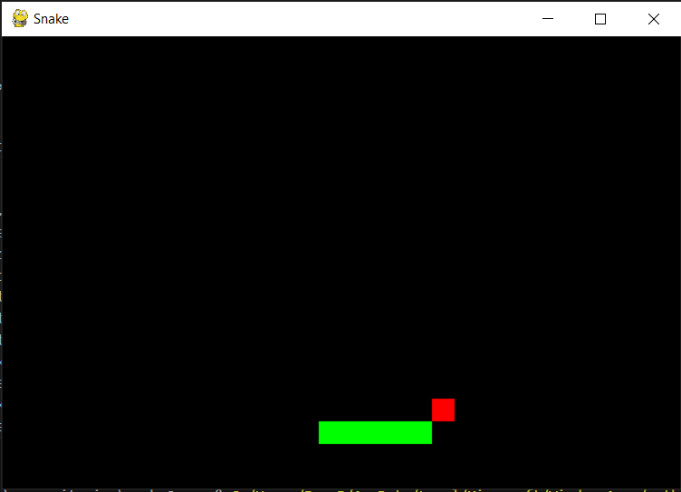
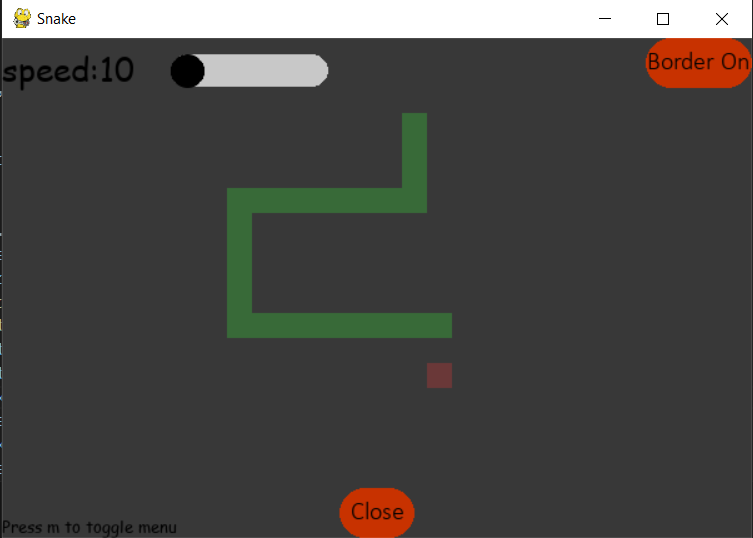

# Snake Game

  

# What is it?
Snake game is as you guessed, a replica of the [snake game](https://en.wikipedia.org/wiki/Snake_(video_game_genre)) using pygame. Its resizable, has a menu which allows you to increase diffculty and toggle the border.


# Installation
```bash
git clone https://github.com/IronRocket/snakeGame.git
cd snakeGame
pip install -r requirements.txt
```
